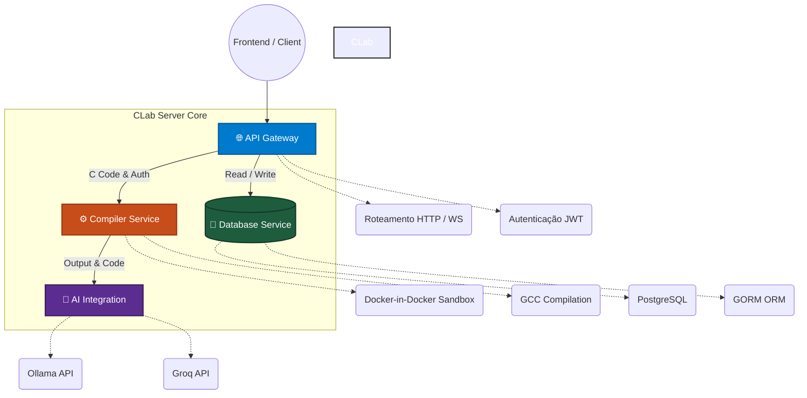

# 🖥️ CLab Server - Backend Engine

Servidor backend do CLab responsável pela compilação segura de código C, execução em sandbox, integração com IA para feedback educacional e gerenciamento de dados locais.


## 🎯 Visão Geral

O CLab Server é o núcleo do sistema de ensino de programação C, fornecendo:

- **Compilação segura** de código C em ambiente isolado
- **Feedback inteligente** via IA local (LLaMA/Ollama) ou cloud (Groq)
- **API REST** para comunicação com o frontend Electron
- **Gerenciamento de dados** com PostgreSQL
- **Banco de Provas** com organização em pastas e atribuição de turmas
- **Avaliação automática** de provas com IA calibrada para notas justas

## 🏗️ Arquitetura



## 📁 Estrutura do Projeto

```
clab-server/
├── cmd/server/main.go
├── internal/
│   ├── api/handlers/
│   │   ├── exam_handler.go         # 🆕 CRUD de provas independentes de turmas
│   │   ├── folder_handler.go       # 🆕 CRUD de pastas do banco de provas
│   │   ├── classroom_handler.go    # Gerenciamento de turmas e ativação de provas
│   │   ├── exercise_topic_handler.go # Tópicos/provas e seleção de variantes
│   │   └── ...
│   ├── ai/analysis.go              # 🧠 Módulo AI (análise, avaliação, geração)
│   ├── compiler/                   # 🔄 Serviço de compilação seguro c/ GCC
│   ├── models/
│   │   ├── exam_folder.go          # 🆕 Pasta para organização de provas
│   │   ├── exercise_topic.go       # Prova/tópico (ClassroomID nullable)
│   │   └── ...
│   ├── dtos/                       # Data Transfer Objects
│   ├── initializers/               # Environment e DB setup
│   ├── security/                   # Auth, JWT, Docker-in-Docker engine
│   └── ws/                         # WebSockets para terminal interativo
├── Dockerfile
└── go.mod
```

## 🚀 Tecnologias Utilizadas

| Camada        | Tecnologia        | Status |
| ------------- | ----------------- | ------ |
| Framework Web | Gin               | ✅     |
| ORM           | GORM + PostgreSQL | ✅     |
| Sandbox       | Docker-in-Docker  | ✅     |
| Compilador    | GCC               | ✅     |
| IA Local      | Ollama (LLaMA)    | ✅     |
| IA Cloud      | Groq API          | ✅     |
| Auth          | JWT               | ✅     |

## ⚡ Quick Start

### Docker (Recomendado)

```bash
git clone https://github.com/VictorHumberto01/clab-server.git
cd clab-server
docker-compose up -d
```

O servidor estará disponível em `http://localhost:8080`.

### Local

```bash
go mod tidy
go run cmd/server/main.go
```

### ⚙️ Variáveis de Ambiente

| Variável       | Descrição                                 | Exemplo                                                                 |
| -------------- | ----------------------------------------- | ----------------------------------------------------------------------- |
| `PORT`         | Porta do servidor                         | `8080`                                                                  |
| `GIN_MODE`     | Modo do Gin                               | `release` ou `debug`                                                    |
| `DATABASE_URL` | String de conexão PostgreSQL              | `host=db user=user password=pass dbname=clab port=5432 sslmode=disable` |
| `JWT_SECRET`   | Chave secreta JWT                         | `your-secret-key-here`                                                  |
| `AI_PROVIDER`  | Provedor de IA. Padrão: `groq`            | `groq` ou `ollama`                                                      |
| `OLLAMA_URL`   | Endpoint Ollama (se `AI_PROVIDER=ollama`) | `http://localhost:11434`                                                |
| `OLLAMA_MODEL` | Modelo Ollama                             | `llama3.2:1b`                                                           |
| `GROQ_API_KEY` | Chave Groq API                            | `gsk_abc123...`                                                         |

## 📡 Endpoints da API

### Autenticação

| Método | Rota        | Descrição         |
| ------ | ----------- | ----------------- |
| `POST` | `/register` | Cria novo usuário |
| `POST` | `/login`    | Retorna JWT       |

### Turmas & Exercícios

| Método | Rota                                 | Descrição                       |
| ------ | ------------------------------------ | ------------------------------- |
| `GET`  | `/classrooms`                        | Lista turmas do usuário         |
| `POST` | `/classrooms`                        | Cria turma (professor)          |
| `POST` | `/classrooms/:id/exam`               | Ativa/desativa prova numa turma |
| `GET`  | `/classrooms/:id/topics`             | Lista exercícios da turma       |
| `POST` | `/classrooms/:id/generate-questions` | Gera questões com IA            |

### 🆕 Banco de Provas

| Método   | Rota                | Descrição                                              |
| -------- | ------------------- | ------------------------------------------------------ |
| `GET`    | `/exams`            | Lista provas do professor (filtrável por `?folderId=`) |
| `POST`   | `/exams`            | Cria prova independente de turma                       |
| `POST`   | `/exams/:id/assign` | Atribui prova a uma turma                              |
| `PUT`    | `/exams/:id/folder` | Move prova para uma pasta                              |
| `DELETE` | `/exams/:id`        | Remove prova                                           |

### 🆕 Pastas de Provas

| Método   | Rota           | Descrição                               |
| -------- | -------------- | --------------------------------------- |
| `GET`    | `/folders`     | Lista pastas do professor               |
| `POST`   | `/folders`     | Cria nova pasta                         |
| `PUT`    | `/folders/:id` | Renomeia pasta                          |
| `DELETE` | `/folders/:id` | Remove pasta (provas ficam "Sem Pasta") |

### Compilação & IA

| Método | Rota       | Descrição                          |
| ------ | ---------- | ---------------------------------- |
| `POST` | `/compile` | Compila e executa código C         |
| `WS`   | `/ws`      | WebSocket para terminal interativo |

## 🧩 Seleção Determinística de Variantes

Ao criar provas com múltiplas variantes por questão, o backend seleciona qual variante cada aluno recebe usando **hash FNV-1a**, sem guardar estado no banco:

```
hashInput = "{StudentID}-{TopicID}-{VariantGroupID}"
variantIndex = fnv32a(hashInput) % totalVariants
```

**Garantias:**

- O mesmo aluno sempre recebe a mesma variante (determinístico).
- Distribuição uniforme entre os alunos da turma.
- Alunos adjacentes recebem variantes diferentes (anti-cola eficaz).

## 🤖 Avaliação Automática por IA

O módulo `GetExamGradingAnalysis` usa um prompt calibrado para **notas justas**:

- ✅ **Nota máxima** quando a lógica e a saída estão corretas.
- ✅ Aceita valores diferentes dos exemplos, desde que a lógica seja correta.
- ❌ Não desconta por estilo, indentação ou formatação.
- ❌ Desconto apenas para saída incorreta, lógica errada ou hardcoding.
- 🛡️ Resistente a prompt injection via comentários no código do aluno.

## 🔒 Segurança (Docker-in-Docker Sandbox)

O ambiente de compilação e execução foi **totalmente reescrito** para utilizar arquitetura Docker-in-Docker, garantindo isolamento absoluto de código hostil (como fork bombs ou exclusão de binários do sistema).

1. **Containers Descartáveis:** Cada execução sobe um container zerado em background. O código C do aluno é copiado para dentro dele. Ao fim da execução, o container é aniquilado.
2. **Isolamento de Execução:** O binário gerado pelo C nunca roda como `root`. A execução dentro do throwaway container sofre restrições de Kernel rigorosas:
   - `--user=65534:65534` (Conta `nobody` não tem permissão de escrita no sistema)
   - `--cap-drop=ALL` & `--security-opt=no-new-privileges` (Trava elevação de privilégio)
   - `--network=none` (Isolado da internet/rede interna)
   - `--pids-limit=64` (Aborta _fork bombs_ instantaneamente)
   - `--memory=128m` (Previne exaustão de memória da máquina host)
   - Workspace do aluno (onde fica seu código e binário) entra em modo **Read-Only** (`chmod 555`) durante a execução, evitando que arquivos criem scripts ou alterem o próprio executável original.
3. **Timeout de 10s:** Código em loop infinito é forçosamente abatido pelo Context timeout do backend.
4. **JWT & Roles:** Todos os endpoints protegidos exigem token válido. Deleções e modificações em massa exigem role `teacher`.

## 🤝 Contribuição

```
feat: nova funcionalidade
fix: corrige bug
docs: documentação
refactor: sem mudança de comportamento
```

---

## 📝 Licença

Este projeto é licenciado sob a **GNU General Public License v2.0 (GPL-2.0)**.
