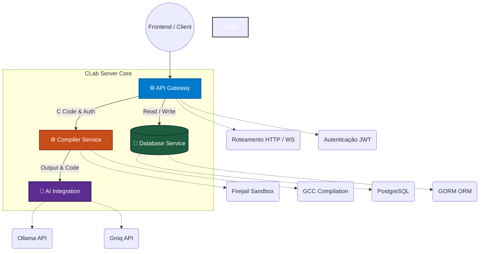

# 🖥️ CLab Server - Backend Engine

Servidor backend do CLab responsável pela compilação segura de código C, execução em sandbox, integração com IA para feedback educacional e gerenciamento de dados locais.


## 🎯 Visão Geral

O CLab Server é o núcleo do sistema de ensino de programação C, fornecendo:

- **Compilação segura** de código C em ambiente isolado
- **Feedback inteligente** via IA local (LLaMA/Ollama)
- **API REST** para comunicação com o frontend Electron
- **Gerenciamento de dados** com PostgreSQL

## 🏗️ Arquitetura



## 📁 Estrutura Atual do Projeto

```
clab-server/
├── cmd/
│   └── server/
│       └── main.go             # ✅ Ponto de entrada da aplicação HTTP e Server
├── internal/
│   ├── api/                    # Handlers e rotas da API em Gin
│   ├── ai/                     # 🧠 Módulo AI (Ollama e Groq API calls)
│   ├── compiler/               # 🔄 Serviço de compilação seguro c/ GCC
│   ├── dtos/                   # Data transfer objects para request body
│   ├── initializers/           # Iniciação rápida de Environment e DB
│   ├── models/                 # Modelos mapeados via GORM (banco PostgreSQL)
│   ├── security/               # Auth, JWT, Utils e Firejail Checks
│   └── ws/                     # Suporte à conexão Real-Time via WebSockets
├── Dockerfile                  # Containerização do serviço
├── go.mod                      # Dependências do projeto (Go 1.21+)
└── README.md                   # Este arquivo
```

## 🚀 Tecnologias Utilizadas

### Backend Core (Go)

- **Gin** - Framework web para API REST ✅
- **Firejail** - Sandbox nativa de SO para execução segura ✅
- **GCC** - Compilador C integrado ✅
- **PostgreSQL** - Banco de dados relacional robusto e escalável ✅
- **GORM** - ORM para manipulação avançada de banco de dados ✅

### Integração Híbrida de IA

- **Ollama** - Interface direta nativa HTTP para modelos LLaMA ✅
- **Groq API** - Chamada para modelos ultra-velozes na nuvem ✅

### Segurança & Autenticação

- **Docker** - Containerização para sandbox escalável ✅
- **Firejail** - Isolamento nativo para cada execução ✅
- **JWT** - Autenticação por tokens estruturados (JSON Web Tokens) ✅

## ⚡ Quick Start

### Executar o Servidor com Docker (Recomendado)

A forma mais fácil de rodar o servidor, banco de dados (PostgreSQL) e configurar a sandbox internamente é usando o Docker Compose:

```bash
# Clone o repositório
git clone https://github.com/VictorHumberto01/clab-server.git
cd clab-server

# Crie um arquivo .env baseado no templateou configure as variáveis necessárias no docker-compose.yml
# Exemplo: Defina GROQ_API_KEY se for usar o Groq

# Execute os containers em segundo plano
docker-compose up -d
```

O servidor estará disponível em `http://localhost:8080`.

### Executar o Servidor Localmente

```bash
# Clone o repositório
git clone https://github.com/VictorHumberto01/clab-server.git
cd clab-server

# Instale dependências
go mod tidy

# Execute o servidor principal
go run cmd/server/main.go
```

O servidor estará disponível em `http://localhost:8080`

### ⚙️ Variáveis de Ambiente

Para rodar o servidor, você precisará configurar algumas variáveis. O arquivo base pode ser encontrado em `.env.example`.

| Variável       | Descrição                                                       | Exemplo                                                                 |
| -------------- | --------------------------------------------------------------- | ----------------------------------------------------------------------- |
| `PORT`         | Porta onde o servidor vai rodar                                 | `8080`                                                                  |
| `GIN_MODE`     | Modo de ambiente Gin                                            | `release` ou `debug`                                                    |
| `DATABASE_URL` | String de conexão com o PostgreSQL                              | `host=db user=user password=pass dbname=clab port=5432 sslmode=disable` |
| `JWT_SECRET`   | Chave secreta para assinatura dos tokens JWT                    | `your-secret-key-here`                                                  |
| `AI_PROVIDER`  | Provedor de inteligência artificial a ser usado. Padrão: `groq` | `groq` ou `ollama`                                                      |
| `OLLAMA_URL`   | Endpoint da API do Ollama (Se `AI_PROVIDER=ollama`)             | `http://localhost:11434`                                                |
| `OLLAMA_MODEL` | Qual modelo o Ollama deve carregar.                             | `llama3.2:1b`                                                           |
| `GROQ_API_KEY` | Chave de API para o provedor em nuvem Groq                      | `gsk_abc123...`                                                         |

### Testar a API

```bash
# Teste básico de compilação
curl -X POST http://localhost:8080/compile \
  -H "Content-Type: application/json" \
  -d '{
    "code": "#include <stdio.h>\nint main() {\n    printf(\"Hello, CLab!\\n\");\n    return 0;\n}",
    "input": ""
  }'
```

### Recursos Implementados ✅

- **Compilação segura** de código C com GCC
- **Execução em sandbox** usando Firejail (quando disponível)
- **Modo inseguro** com confirmação do usuário (fallback)
- **Timeout de execução** (3 segundos)
- **Suporte a input** do usuário para programas interativos
- **Logs detalhados** para debugging
- **Limpeza automática** de arquivos temporários

## 🔒 Segurança - Implementação Atual

### Sistema de Sandbox ✅

- **Firejail Integration**: Execução isolada quando disponível
  - `--quiet`: Execução silenciosa
  - `--net=none`: Sem acesso à rede
  - `--private=tmpdir`: Filesystem isolado
- **Modo Inseguro Controlado**: Fallback com confirmação dupla do usuário
- **Timeout de Execução**: Limite de 3 segundos para prevenir loops infinitos
- **Diretório Temporário**: Cada execução usa um diretório isolado
- **Limpeza Automática**: Remoção de arquivos temporários após execução

### Validação de Entrada ✅

- **JSON Binding**: Validação automática de requests
- **Timeout Protection**: Processo killado após limite de tempo
- **Concurrent Safe**: Goroutines para execução não-bloqueante

### Próximas Implementações 🔄

- **Rate limiting** para prevenir abuse
- **Validação** de tamanho de código
- **Filtragem** de comandos perigosos
- **Logs de auditoria** estruturados

## 🤝 Contribuição

### Estrutura de Commits

```
feat: adiciona nova funcionalidade
fix: corrige bug existente
docs: atualiza documentação
test: adiciona ou corrige testes
refactor: refatora código sem mudar funcionalidade
perf: melhora performance
chore: tarefas de manutenção
```

### Pull Request Guidelines

1. Fork o repositório
2. Crie uma branch descritiva
3. Implemente a funcionalidade com testes
4. Atualize a documentação se necessário
5. Submeta o PR com descrição clara

---

## 📝 Licença

Este projeto é licenciado sob a **GNU General Public License v2.0 (GPL-2.0)**.
O CLab Server é um software livre e de código aberto; você pode redistribuí-lo e/ou modificá-lo sob os termos da licença GNU GPL v2 conforme publicada pela Free Software Foundation.
